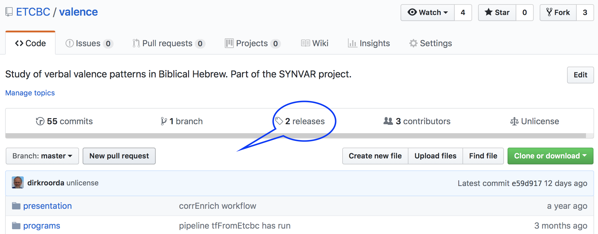
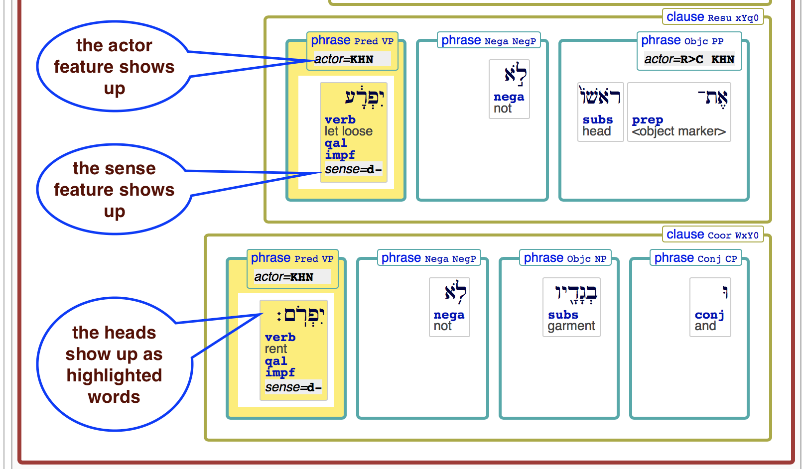
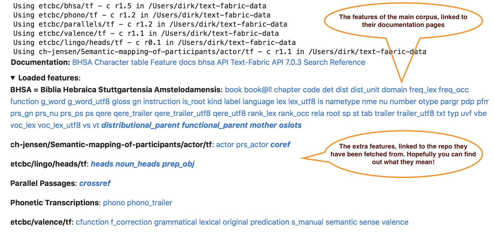

# Adding data modules

Text-Fabric supports the flow of creating research data,
packaging it, distributing it, and importing in apps.

## Assumptions

The data sharing workflow is built around the following assumptions:

??? note "main corpus app"
    You work with a main corpus for which a text-fabric app is available.
    See [Corpora](../About/Corpora.md)

??? note "versioned tf data"
    The data you share consists of a set of TF features, tied to a specific
    *version* of the main corpus, preferably the most recent version.
    The new features must sit in a directory named after the version
    of the main corpus they correspond to.

??? note "local github"
    The data you share must reside in a directory on your hard drive.
    The convention is, that you have a directory `github` under your
    home directory. And inside `github`, you have directories for
    organizations or people first, and then repositories, exactly as 
    the online GitHub is organized. 

    Your own data should be in such a repo as well, e.g.

    `ch-jensen/Semantic-mapping-of-participants/actor/tf`

    or

    `etcbc/lingo/heads/tf`

    or

    `annotation/banks/sim/tf`

??? note "synchronized with GitHub"
    You must have your local repo contents synchronized with that on GitHub.

    Now other people can use your data.
    Whenever you push updates, users may fetch the updated data, depending
    on how they call up your data, see below.

??? note "release on GitHub"
    If your data is reasonably stable, consider making an official *release*
    on GitHub.
    Then you must attach your features as a zip file to that release.
    Text-Fabric has a command to produce a zip file with exactly the
    right structure and name.

    Consider to connect your repo with 
    [Zenodo]({{zenodo}}).
    Then every time to make a release, your repo will be archived for the long term,
    and you get a DOI pointing to the released version. 

??? note "get data"
    In order to get data, the only thing Text-Fabric needs to know,
    is a string with the organisation or person, the repository,
    and the path within the repository.

    Based on the string `{org}/{repo}/{path}` it will find the online
    repository, check the latest release, find the zip file,
    download and expand it to your local
    `~/text-fabric/data/{org}/{repo}/{path}`

    If there are no releases, it will find the latest commit and use the
    data from there.

    But you may go back in the history, see below.

??? note "everywhere"
    The extra data is accessible whether you work in a Jupyter notebook,
    or in the Text-Fabric browser.
    The extra features are clearly listed after the incantation in a notebook,
    and they show up in the pretty displays in the TF browser.
    And when you export data from the TF browser, all data modules are reported
    in the provenance section.

## Step by step

When you develop your own data features, you'll probably make many changes before
you take the trouble of publishing them as a zip file attached to a release/
Here we describe the easiest workflow to work with your developing data with a view to share
it much less often than you modify it.

??? abstract "Produce in your local GitHub folder"
    You probably have a program or notebook that synthesizes a bunch of new features.
    It is a good idea to have that program in a version control system, and publish
    it on GitHub, in a repository of your choice.

    Set up that program in such a way, that your features end up in the same repository,
    in a folder of your choosing, but directly under a folder that corresponds with
    the version of the main data source against which you are building your data.

    Currently, your features only live on your computer, in your local github folder.
    You may or may not commit your local changes to the online GitHub.
    But you do not want to create a new release and attach your zipped feature data to it yet.

    We use the existing
    [annotation/banks/tf]({{tfbanks}}/programs/convert.ipynb)
    data as an example.

    We assume you have this data locally, in 

    ```
    ~/github/annotation/banks/tf
    ```

    under which there are versions such as `0.2`, which contain the actual `.tf` files.

    We are going to develop the `sim` feature, in

    ```
    ~/github/annotation/banks/sim/tf
    ```

??? abstract "Test the features"
    When you want to load the new features, you can use
    the `mod` parameter:
    
    ```python
    use('banks', mod=f'annotation/banks/sim/tf')
    ```

    But TF then tries to download it from GitHub, or look it up from your `~/text-fabric-data`.
    Both will fail, especially when you let TF manage your `~/text-fabric-data` directory.

    You have to pass 'clone' as the checkout option: 

    ```python
    use('banks', mod=f'annotation/banks/sim/tf:clone')
    ```

    The `clone` option means: use local data under `~/github`.
    With this set, TF looks in the right place inside your `~/github` directory.
    It will not go online, and not look into `~/text-fabric-data`.

??? abstract "Commit and push your features"
    When the time comes to share your new feature data, everything is already in place
    to do that.

    ??? caution "Write access"
        You can only do the following steps for repositories for which you have write access,
        so do not try to perform this on `annotation/banks` but use a repo of your own.**

    On the command line, go to the directory of your repository, and say

    ```sh
    git add --all .
    git commit -m "data update or whatever"
    git push origin master
    ```

    and then your data is shared in the most basic way possible.
    But very effectively.

    From now on, other users (and you too) can use that data by passing just the switch

    ```python
    use('banks', mod=f'annotation/banks/sim/tf')
    ```

    without the `clone` option.
    If you do this, you get a freshly downloaded copy of your features in
    your `~/text-fabric-data` directory.
    And every time you do this again, a check for updates will be performed.

??? abstract "Make a release"
    If you want to single out a certain commit as stable data and give it a version number,
    go to your repo on GitHub, click the releases link, and make a new release.

    

    Then click *Draft a new release*

    

    Fill in the details, especially the release version (something like `0.2`),
    although nothing in the workflow depends on the exact form of the version number;
    you will see the release version in the provenance, though.

    Click the button *Publish release*.

    Now your data is available to others.

    Now the users of your data can refer to that copy by means of the version number.
    By default, the data from the latest release will be downloaded,
    and subsequent unreleased commits will be ignored.

??? abstract "Package into zip files"
    If you share many features, or a whole TF dataset,
    it is more economical to zip that data and attach it as a binary to the release.

    It is vitally important for the TF workflows that that zip file has the right name 
    and the right structure.

    Text-Fabric comes with a command to create that zip file for you.

    Execute the following command in your terminal:

    ```sh
    text-fabric-zip annotation/banks/tf
    ```

    You'll see

    ```
    Create release data for annotation/banks/tf
    Found 2 versions
    zip files end up in /Users/dirk/Downloads/annotation-release/banks
    zipping annotation/banks           0.1 with  10 features ==> tf-0.1.zip
    zipping annotation/banks           0.2 with  10 features ==> tf-0.2.zip
    ```

    and as a result you have this in your Downloads folder

    ```
    ~/Downloads/annotation-release/banks:
      tf-0.1.zip
      tf-0.2.zip
    ```

    Attach these versions, or just the newest version, to the release and publish the release.
            
    

    Zip your data with the `text-fabric-zip` command as explained above.
    It will look into your local github directory, pickup the features from there,
    zip them, and put the zip files in your Downloads folder. Then you can pick
    that zip file up and attach it manually to a new release of your repository
    on the online GitHub.

??? abstract "Continue developing your features"
    Probably you'll make changes to your features after having published them.
    Then you have the cutting edge version of your features in your local github
    directory, and the published version in your text-fabric-data directory.

    When you make new commits, users that call up your data in the standard way,
    will still get the latest stable release.

    But users that say 

    ```python
    use('banks', mod=f'annotation/banks/sim/tf:hot')
    ```

    will get your cutting edge latest commit.

## Use data
Now we are just reading data,
so the following steps
you can perform literally,
without fear of overwriting data.

??? abstract "Check it out!"
    When calling up data and a TF-app, you can go back in history:
    to previous releases and previous commits, using a `checkout` parameter.

    You have already seen it, and here we spell them out in greater detail.

    You can specify the checkout parameter separately for 

    * the TF-app code (so you can go back to previous instantiations of the TF-app)
    * the main data of the app plus its standard data modules
    * every data-module that you include by means of the `--mod=` parameter.

    The values of the checkout parameters tell you to use data that is:

    * `clone`: locally present under `~/github` in the appropriate place
    * `local`: locally present under `~/text-fabric-data` in the appropriate place
    * `latest`: from the latest online release
    * `hot`: from the latest online commit
    * `''`: (default):
      from the latest online release, or if there are no releases,
      from the latest online commit
    * `2387abc78f9de...`: a concrete commit hash found on GitHub (under Commits)
    * `v1.3`: a release tag found on GitHub (under Releases)

    You pass the checkout values as follows:

    * for the TF-app:
      **after the app name**:
      `bhsa:clone`, `oldbabylonian:local`, `quran`.
      If you leave it out, it defaults to the empty string: latest release or commit.
    * for the main data and standard data modules of the app:
      **in the `checkout` parameter**: 
      `checkout='clone'`, `checkout='local'`, `checkout=''`.
      If you omit `checkout` out, it defaults to the empty string: latest release or commit.
    * for the data that you call up as a module:
      **after the module name**:
      `annotation/banks/sim/tf:clone`, `annotation/banks/sim/tf:local`,
      `annotation/banks/sim/tf`.
      If you leave it out, it defaults to the empty string: latest release or commit.

    The checkout parameter can be used in the `use()` function when you call up
    Text-Fabric in a program (or notebook) and when you call up the text-fabric
    browser on the command line:

    ```python tab="notebook or program"
    use('banks:clone', checkout='latest', mod='annotation/banks/sim/tf:hot')
    ```

    ```sh tab="TF browser"
    text-fabric banks:clone --checkout=latest --mod=annotation/banks/sim/tf:hot
    ```

    Note that you can pass different specifiers for the distinct portions of data and code
    that you want to use.

    To see it in action, consult the [repo]({{tutnb}}/banks/repo.ipynb) notebook.

??? abstract "More about using data modules"
    Suppose you have called up a data module:

    ```python tab="notebook or program"
    A = use('banks', mod='annotation/banks/sim/tf')
    ```

    ```sh tab="TF browser"
    text-fabric banks --mod=annotation/banks/sim/tf
    ```

    You can then use the features of the module in everywhere.

    Fill out this query:

    ```
    word letters~th
    -sim=100> word
    ```

    and expand the first result in Genesis 1:1.

    The display looks like this:

    

    And if you export the data, the extra module is listed in the provenance.

    

    ??? hint "Feature display in the TF browser"
        You can use new features in queries.
        Pretty displays will show those features automatically, because
        all features used in a query are displayed in the expanded view.

        If you want to see a feature that is not used in the query
        you can add it as a trivial search criterion.

        For example, if you want to see the `sense` feature when looking for phrases,
        add it like this

        ```
        clause
          phrase sense*
        ```

        The `*` means: always true, so it will not influence the query result set,
        only its display;

        In fact, the feature sense is only present on nodes of type `word`.
        But mentioning a feature anywhere in the query
        will trigger the display wherever it occurs with a non-trivial values.

        The extra data modules are also shown in the provenance listings
        when you export data from the browser.

    ??? hint "Feature display in a Jupyter notebook"
        After the incantation, you see an overview of all features per module where they come from,
        linked to their documentation or repository.

        You can use the new features exactly as you are used to, with `F` and `E`
        (for edge features).

        They will also automatically show up in `pretty` displays,
        provided you have run a query using them before.

        Alternatively, you can
        tell which features you want to add to the display.
        That can be done by [`displaySetup()` and `displayReset()`](App.md#display),
        using the parameter `extraFeatures`.

??? abstract "More modules at the same time"
    Now that we get the hang of it, we would like to use multiple modules
    added to a main data source.

    We go to the `bhsa` (Hebrew Bible) and use
    the `heads` feature
    that Cody Kingham prepared in
    [etcbc/lingo/heads]({{etcbcgh}}/lingo/tree/master/heads)
    as well as the `actor` feature that Christian Høygaard-Jensen prepared in
    [ch-jensen/Semantic-mapping-of-participants]({{jensengh}})
    We'll include it next to the valence data, by calling the TF browser like this:

    ```sh
    text-fabric bhsa --mod=etcbc/valence/tf,etcbc/lingo/heads/tf,ch-jensen/Semantic-mapping-of-participants/actor/tf
    ```

    Unsurprisingly: the `heads` and `actor` features and friends
    are downloaded and made ready for import.

    You can test it by means of this query

    ```
    book book=Leviticus
      phrase sense*
        phrase_atom actor=KHN
      -heads> word
    ```

    Note that `heads` is an edge feature.

    

    In a Jupyter notebook, it goes like this:

    ```python
    from tf.app import use
    A = use(
        'bhsa',
        mod=(
            'etcbc/valence/tf,'
            'etcbc/lingo/heads/tf,'
            'ch-jensen/Semantic-mapping-of-participants/actor/tf'
        ),
        hoist=globals(),
    )
    ```

    

    Now you can run the same query as before:

    ```python
    results = A.search('''
    book book=Leviticus
      phrase sense*
        phrase_atom actor=KHN
      -heads> word
    ''')
    ```

    And let's see results in pretty display.
    We have to manually declare that we want to see the `sense` and `actor` feature.

    ```
    A.displaySetup(extraFeatures='sense actor')
    A.show(results, start=8, end=8, condensed=True, condenseType='verse')
    ```

    See the
    [share]({{tutnb}}/bhsa/share.ipynb)
    tutorial.

## Exercise
See whether you can find the quote in the Easter egg that is in
`etcbc/lingo/easter/tf` !

