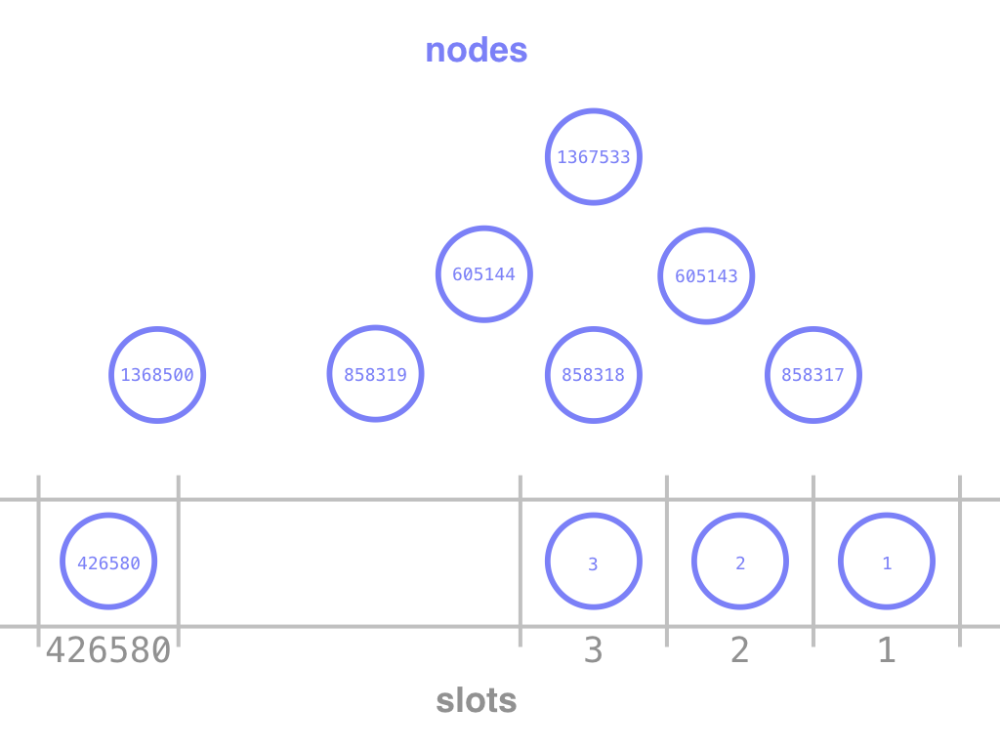
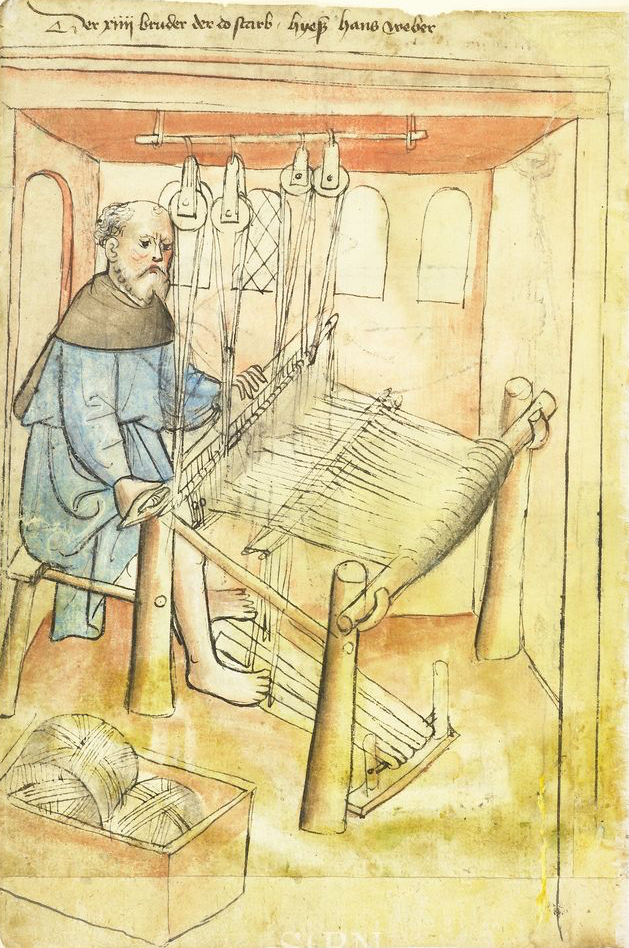
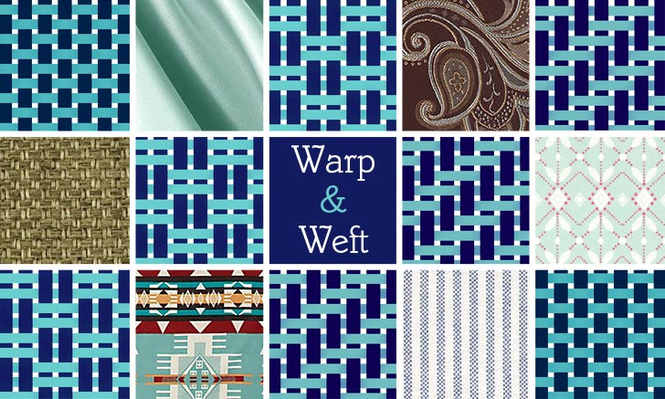
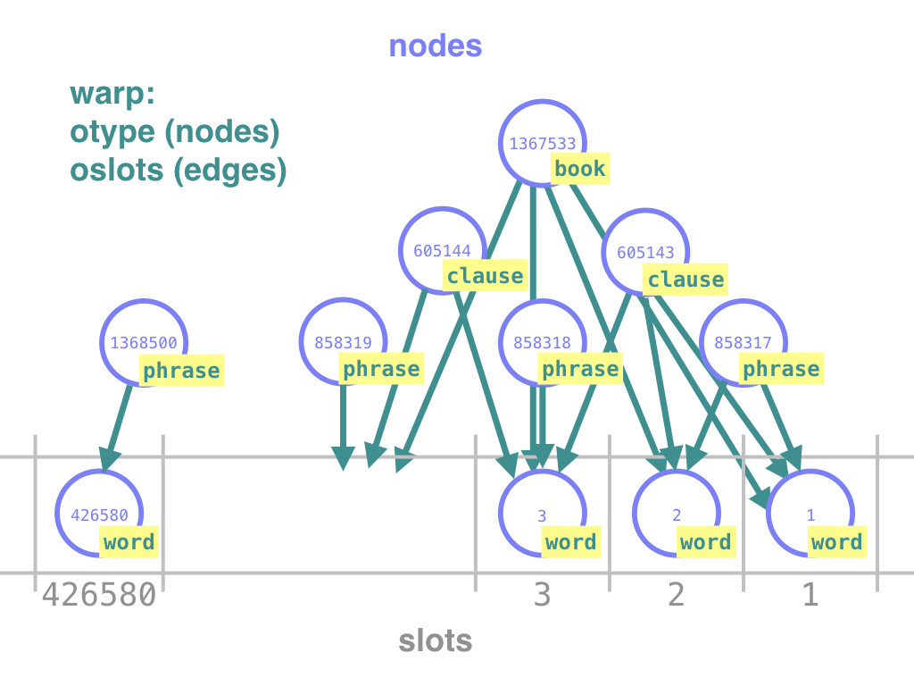
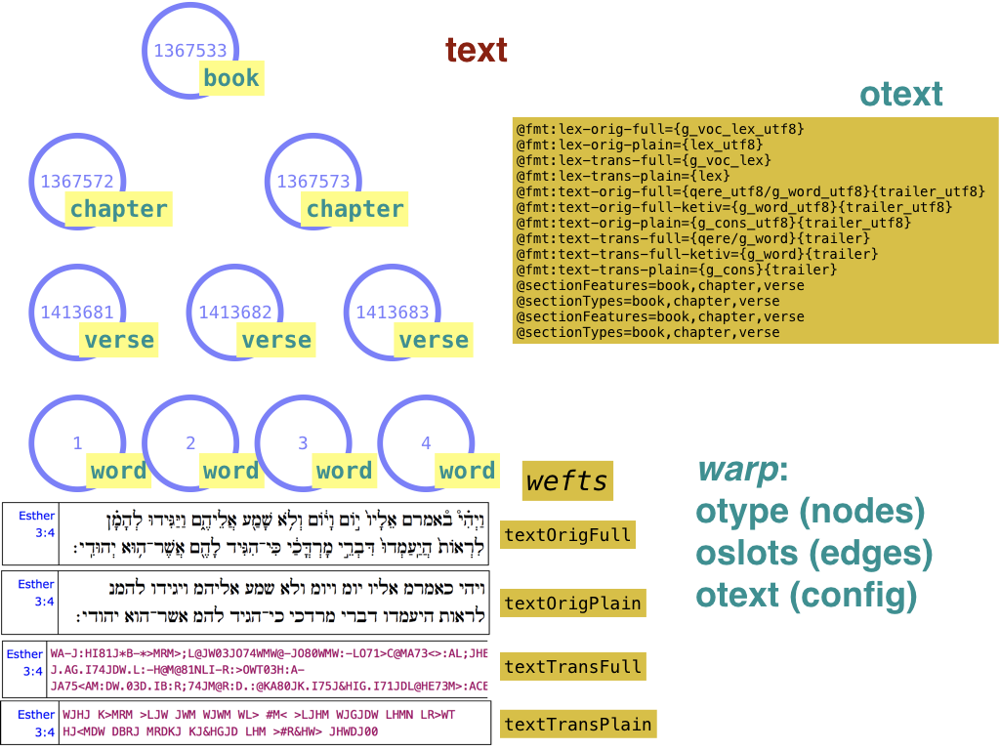

# Text-Fabric Data Model

> Everything about us, everything around us, everything we know and can know of
> is composed ultimately of patterns of nothing;
> that’s the bottom line, the final truth.
> So where we find we have any control over those patterns,
> why not make the most elegant ones, the most enjoyable and good ones,
> in our own terms?"
>
> -- **Iain M. Banks**.
"[Consider Phlebas](https://read.amazon.com/kp/kshare?asin=B002TXZRQI&id=NpPGzf_HT5aADabyiDDSIQ&reshareId=RZ91SGMZJPWK9S1Y4EZX&reshareChannel=system):
A Culture Novel (Culture series)"

## At a glance

Take a text, put a grid around the words, and then leave out the words. What is
left, are the textual positions, or *slots*.

Pieces of text correspond to phrases, clauses, sentences, verses, chapters,
books. Draw circles around those pieces, and then leave out their contents. What
is left, are the textual objects, or *nodes*.

Nodes can be connected to other nodes by *edges*. A basic function of edges is
to indicate *containment*: *this* node corresponds to a set of slots that is
contained in the slots of *that* node. But edges can also denote more abstract,
linguistic relations between nodes.

Nodes have types. Types are just a label that we use to make distinctions
between word nodes, phrase nodes, ..., book nodes. The type assignment is an
example of a *feature* of nodes: a mapping that assigns a piece of information
to each node. This type assignment has a name: **otype**, and every Text-Fabric
dataset has such a feature.

Nodes may be linked to textual positions or *slots*. Some nodes are linked to a
single slot, others to a set of slots, and yet others to no slots at all.

Nodes of the first kind are identified with their slots, they have the same
number as slot as they have as node.

Nodes of the second kind have an edge to every slot (which is also a node) that
they are linked to. The collection of these edges from nodes of the second kind
to nodes of the first kind, is an example of a *feature* of edges: a mapping
that assigns to each pair of nodes a boolean value: is this pair a link or not?
This particular edge feature is called **oslots**, and every Text-Fabric dataset
has such a feature.

Nodes of the third kind represent information that is not part of the main body
of text. We could represent the lexicon in this way. However, it is also
possible to consider *lexeme* as a node type, where every lexeme node is linked
to the set of slots that have an occurrence of that lexeme.

## Fabric metaphor

[AD 1425 Hausbücher der Nürnberger Zwölfbrüderstiftungen](http://www.nuernberger-hausbuecher.de/75-Amb-2-317-4-v/data)

Before we go on, we invite you to look at a few basic terms in the craft of
[weaving](https://en.wikipedia.org/wiki/Weaving).

A weaver sets up a set of fixed, parallel threads, the *warp*. He then picks a
thread, usually a colourful one, and sends it in a perpendicular way through the
warp. This thread is called the *weft*.

The instrument that carries the wefts through the warp is called the *loom*. The
weaver continues operating the loom, back and forth, occasionally selecting new
wefts, until he has completed a rectangular piece of fabric, the *weave*.

[source](https://sew4home.com/tips-resources/buying-guide/all-about-fabric-weaves-tutorial)

Now Text-Fabric, the tool, can be seen as the loom that sends features (the
wefts) through a warp (the system of nodes and edges).

The features **otype** and **oslots** are the ones that set up the system of
nodes and edges. That's why we call them *warp* features. Every Text-Fabric
dataset contains these two warp features. (Later on we'll see a third member of
the warp, **otext**). They provide the structure of a text and its annotations,
without any content. Even the text itself is left out!

All other information is added to the warp as *features* (the wefts): node
features and edge features. A feature is a special aspect of the textual
information, isolated as a kind of module. It is a collection of values which
can be woven as a weft into the warp.

One of the more basic things to add to the warp is the text itself. Ancient
texts often have several text representations, like original (Unicode)
characters or transliterated characters, with or without the complete set of
diacritical marks. In Text-Fabric we do not have to choose between them: we can
package each representation into a feature, and add it to the fabric.

A Text-Fabric data set is a warp (*otype*, *oslots*) plus a collection of wefts
(all other features). We may add other features to the same warp. Data sets with
only wefts, but no warps, are called modules. When you use modules with a
dataset, the modules must have been constructed around the warp of the dataset.

Whenever you use Text-Fabric to generate new data, you are weaving a weave. The
resulting dataset is a tight fabric of individual features (wefts), whose values
are taken for a set of nodes (warp).

Some features deserve a privileged place. After all, we are dealing with *text*,
so we need a bit of information about which features carry textual
representations and sectioning information (e.g. books, chapters, verses).

This information is not hard-wired into Text-Fabric, but it is given in the form
of a *config* feature. A config feature has no data, only metadata. Every
Text-Fabric dataset may contain a config feature called **otext**, which
specifies which node types and features correspond to sectional units such as
books, chapters, and verses. It also contains templates for generating text
representations for the slots.

The **otext** feature is optional, because not all Text-Fabric datasets are
expected to have extensive sectioning and text representation definitions.
Especially when you are in the process of converting a data source (such as a
treebanks set) into a Text-Fabric dataset, it is handy that Text-Fabric can load
the data without bothering about these matters.

## Model

We summarize in brief statements our data model, including ways to represent the
data, serialize it, and compute with it.

Text objects:

*   occupy arbitrary compositions of slots;
*   carry a *type* (just a label); all *slots* carry the same type, the *slot
    type*; e.g. *word* or *character*;
*   can be annotated by *features* (key-value pairs)
*   can be connected by directed, labelled links to other text objects.

The model knows which feature assigned values to nodes and edges. If two
different features assign a value to an edge or node, both values can be read
off later; one through the one feature, and one through the other.

The data in Text-Fabric is organized as an annotated directed graph with a bit
of additional structure. The correspondence is

*   text positions => the first so many slot numbers
*   text objects => nodes
*   links between text objects => edges
*   information associated with text objects => node features
*   labels on links between text objects => edge features
*   **NB:** since every link is specified by an edge feature, every link is
    implicitly labelled by the name of the edge feature. If the edge feature
    assigns values to edges, those values come on top of the implicit label.
*   types of text objects => a special node feature called `otype` (read: object
    type)
*   extent of text objects in terms of slots => a special edge feature called
    `oslots` (read: object slots)
*   optional specifications for sectioning and representing text => a special
    config feature called `otext` (read: object text)

Together, the `otype`, `oslots`, and the optional `otext` features are called
the **warp** of a Text-Fabric dataset.

## Representation

We represent the elements that make up such a graph as follows:

*   nodes are integers, starting with 1, without gaps;
*   the first `maxSlot` nodes correspond exactly with the slots, in the same
    order, where `maxSlot` is the number of slots;
*   nodes greater than `maxSlot` correspond to general text objects;
*   node features are mappings of integers to values;
*   edge features are mappings of pairs of integers to values; i.e. edges are
    ordered pairs of integers; labelled edges are ordered tuples of two nodes and
    a value;
*   values (for nodes and for edges) are strings (Unicode, utf8) or numbers;
*   the `otype` feature maps
    *   the integers `1..maxSlot` (including) to the *slot type*, where `maxSlot` is
        the last *slot*,
    *   the integers `maxSlot+1..maxNode` (including) to the relevant text object
        types;
*   the `oslots` feature is an valueless edge feature, mapping all non-slot nodes
    to sets of slots; so there is an `oslots` edge between each non-slot node and
    each slot *contained* by that node;
*   a Text-Fabric dataset is a collection of node features and edge features
    containing at least the *warp* features `otype`, `oslots`, and, optionally
    `otext`.

## More about the warp

The warp/weft distinction is a handy way of separating textual organisation from
textual content. Let us discuss the warp features a bit more.

### otype: node feature

Maps each node to a label. The label typically is the kind of object that the
node represents, with values such as

    book
    chapter
    verse
    sentence
    clause
    phrase
    word

There is a special kind of object type, the *slot type*, which is the atomic
building block of the text objects. It is assumed that the complete text is
built from a sequence of *slots*, from slot `1` till slot `maxSlot` (including),
where the slots are numbered consecutively. There must be at least one slot.

All other objects are defined with respect to the *slots* they contain.

The *slot type* does not have to be called `slot` literally. If your basic
entity is `word`, you may also call it `word`. Slots are then filled with
*words*. You can model text on the basis of another atomic entity, such as
`character`. In that case, slots are filled with *characters*. Other choices may
be equally viable.

The only requirement is that all slots correspond exactly with the first so many
nodes.

The `otype` feature will map node `1` to a node type, and this node type is the
type of all subsequent slots and also of the things that fill the slots.

Note also the sectional features `book chapter verse` here. They will play a
role in the third, optional, warp feature `otext`.

### oslots: edge feature

Defines which slots are occupied by which objects. It does so by specifying
edges from nodes to the slots they contain.

From the information in `oslots` we can compute the embedding relationships
between all nodes.

It gives also rise to a canonical [ordering](../Api/General.md#sorting-nodes) of nodes.

### otext: config feature (optional)

Declares which node types correspond to the first three levels of sectioning,
usually *book*, *chapter*, *verse*. Also declares the corresponding features to
get the names or numbers of the sections in those levels. Text-Fabric uses this
information to construct the so-called Text-API, with functions to

*   convert nodes to section labels and vice versa,
*   represent section names in multiple languages,
*   print formatted text for node sets.

If information about sections or text representations are missing, Text-Fabric
will build a reduced Text-API for you, but it will continue.

## Serializing and precomputing

When Text-Fabric works with a dataset, it reads feature data files, and offers
an API to process that data. The main task of Text-Fabric is to make processing
efficient, so that it can be done in interactive ways, such as in a Jupyter
notebook. To that end, Text-Fabric

*   optimizes feature data after reading it for the first time and stores it in
    binary form for fast loading in next invocations;
*   precomputes additional data from the warp features in order to provide
    convenient API functions.

In Text-Fabric, we have various ways of encoding this model:

*   as plain text in `.tf` feature files,
*   as Python data structures in memory,
*   as compressed serializations of the same data structures inside `.tfx` files
    in `.tf` cache directories.
