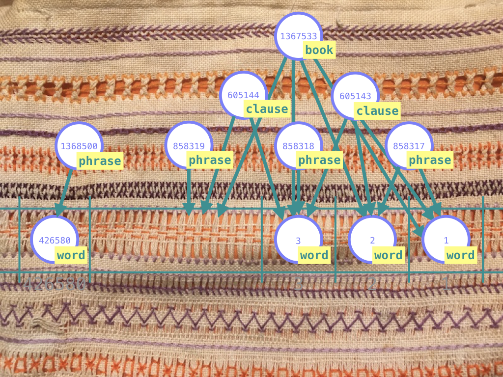
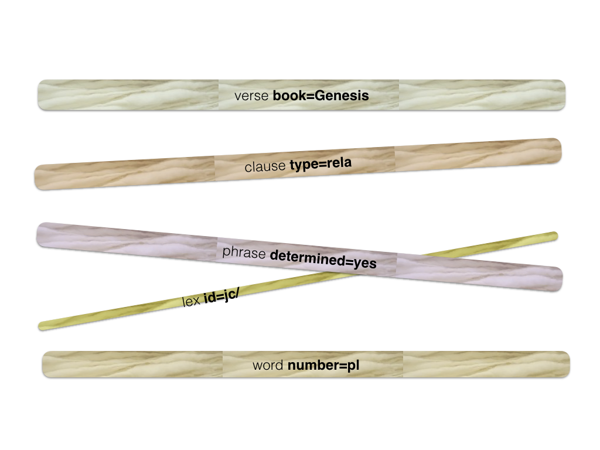
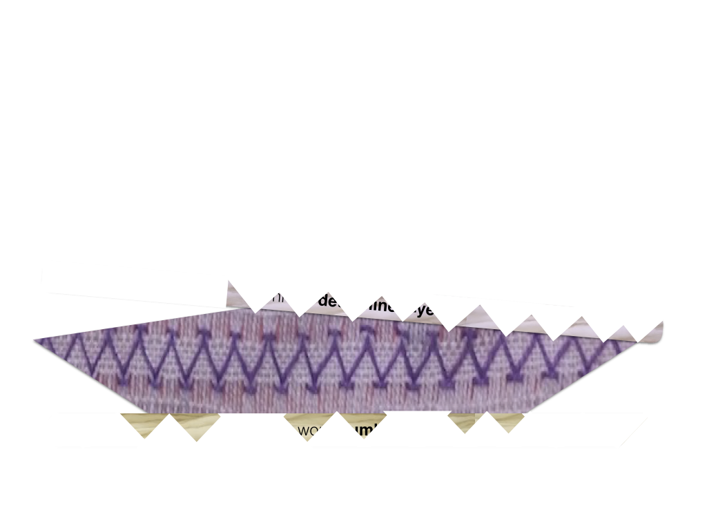
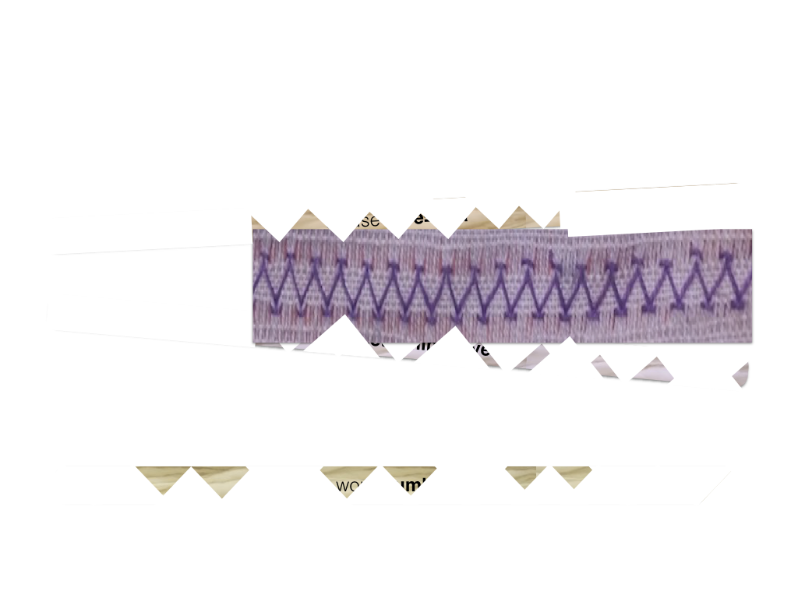
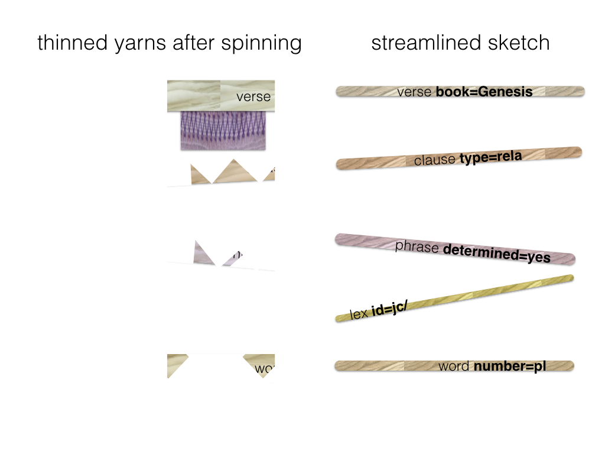

# Search Design

## Fabric metaphor

The search space is a massive fabric of interconnected material. In it we
discern the structures we are interested in: little pieces of fabric, also with
interconnected material.

When we search, we have a fabric in mind, woven from specific material, stitched
together in a specific manner.

Search in Text-Fabric works exactly like this: you give a sample patch, and
Text-Fabric fetches all pieces of the big fabric that match your patch.

The textile metaphor is particularly suited for grasping the search part of
Text-Fabric, so I'm going to stick to it for a while. I have used it in the
actual code as well, and even in the proofs that certain parts of the algorithm
terminate and are correct. Yet it remains a metaphor, and the fit is not exact.

The basic pattern of search is this:

textile | text | example
------- | ---- | -------
take several fleeces | pick the nodes corresponding to a node type | `word`s, `phrase`s, `clause`s, `verse`s
spin thick yarns from them | filter by feature conditions | `part-of-speech=verb` gender=`f` `book=Genesis` `vt`
spin the yarns further into thin yarns | throw away nodes that do not have the right connections | feature conditions on a verse also affect the search space for sentences, clauses, etc., and vice versa
stitch the yarns together with thread | build results by selecting a member for every filtered node set | `word` node `123456` in `phrase` node `657890` in `clause` node `490567` in `verse` node `1403456`

We will explain the stages of the fabrication process in detail.

## Fleece

A fleece corresponds with a very simple search template that asks for all
objects of a given type:

    word

or

    clause

or, asking for multiple types:

    verse
    clause
    phrase
    lex
    word

Fleeces are the raw material from which we fabricate our search results.

Every node type, such as `word`, `sentence`, `book` corresponds to a fleece. In
Text-Fabric, every node has exactly one node type, so the whole space is neatly
divided into a small set of fleeces.

The most important characteristic of a fleece is it size: the number of nodes in
a node type.

## Spinning thick yarn

Consider search templates where we ask for specific members of a node type, by
giving feature constraints:

    verse book=Genesis
    clause type=rela
    phrase determined=yes
    lex id=jc/
    word number=pl vt
    vt

Every line in this search templates we call an *atom*: a node type plus a
feature specification. The result of an atom is the set of all nodes in that
node type that satisfy those feature conditions. Finding the results of an atom
corresponds with first thing that we do with a fleece: *spin* a thick *yarn*
from it. Yarns in general are obtained by spinning fleeces, i.e. by filtering
node sets that correspond to a node type.

A search template may contain multiple atoms. Text-Fabric collects all atoms of
a template, grabs the corresponding fleeces, and spins thick yarns from them.
For each atom it will spin a yarn, and if there are several atoms referring to
the same node type, there will be several yarns spun from that fleece. This
spinning of thick yarns out of fleeces happens in just one go. All fleeces
together contain exactly all nodes, so Text-Fabric walks in one pass over all
nodes, applies the feature conditions, and puts the nodes into the yarns
depending on which conditions apply.

By the way, for the Hebrew dataset, we have 1.4 million nodes, and a typical
pass requires a fraction of a second.

The most important characteristic of a yarn is its *thickness*, which we define
as the number of nodes in the yarn divided by the number of nodes in the fleece.

For example, a yarn consisting of the `book` node of Genesis only, has a
thickness of 1/39, because there are 39 books in the fleece. A much thicker yarn
is that of the verbs, which has a thickness of roughly 1/6. A very thin thread
is that of the word `<CQH` (which occurs only once) with a thickness of only
1/400,000.

## Spinning thin yarns

In order to find results, we have to further narrow down the search space. In
other words, we are going to spin our thick yarns into thinner and thinner
yarns. Before we can do that, we should make one thing clear.

### Connected by constraints

If the template above were complete, it would lead to a monstrous number of
results. Because a result of a template like this is any combination of verse-,
clause-, phrase-, lex-, word nodes that individually satisfy their own atom
condition. So the number of results is the product of the number of results of
the individual atoms, which is pretty enormous. It is hard to imagine a
situation where these results could be consumed.

Usually, there are *constraints* active between the atoms. For example in a
template like this:

    1 verse book=Genesis
    2    clause type=rela
    3        phrase determined=yes
    4            w:word number=pl vt
    5
    6 l:lex id=jc/
    7
    8 w ]] l

The meaning of this template is that we look for a `verse` that

*   (1) claims to be in Genesis
*   (2) has a clause whose type is `rela`
*   (3) which in turn has a phrase of a determined character
*   (4) which contains a word in the plural and that has a verbal tense (vt)

There should also be a

*   (6) lex object, identified by `jc/`

which is connected to the rest by the constraint that

*   (8) the word of line 4 is contained in it.

Note that all atoms are linked by constraints into one network. In graph
theoretical terms: this template consists of exactly one
[connected component](http://www.analytictech.com/networks/graphtheory.htm).

If this were not so, we would have in fact two independent search tasks, where
the result set would be the (cartesian) product of the result sets of the
separate components.

For example, if line 8 were missing, we would effectively search for things that
match lines 1-4, and, independently, for things that match line 6. And every
result of the first part, combined with any result of the second part, would be
a valid result of the whole.

Well, Text-Fabric is nobody's fool: it refuses to accept two search tasks at the
same time, let alone that it wants to waste time to generate all the results in
the product. You will have to fire those search tasks one by one, and it is up
to you how you combine the results.

The upshot it: **the atoms in the search template should form a network,
connected by constraints**.

Text-Fabric will check this, and will only work with search templates that have
only one connected component.

### Terminology

By now we have arrived at the idea that our search template is a graph
underneath: what we have called *atoms* are in fact the nodes, and what we have
called *constraints*, are the edges.

From now on, we will call the *atoms* **qnodes** and the constraints **qedges**.
The **q** is to distinguish the nodes and the edges from the nodes and the edges
of your dataset, the *text* nodes and *text* edges. When we use the term *nodes*
and *edges* we will always refer to *text* nodes and edges.

When we are searching, we maintain a *yarn* for every *qnode*. This yarn starts
out to be the thick yarn as described above, but we are going to thin them.

We can also see how our query templates are really *topographic*: a query
template is a piece of local geography that we want to match against the data.
Finding results is nothing else than instantiating *qnodes* of the search
template by text nodes in such a way that the *qedges* hold between the text
edges.

### Spinning a qedge

So, where were we? We have spun thick threads based on the *qnodes*
individually, but we have not done anything with the *qedges*. That is going to
change now.

Consider this piece of search template:

    4            w:word number=pl vt
    5
    6 l:lex id=jc/
    7
    8 w ]] l

So our *qnodes* are `w` and `l`, and our *qedge* is `w ]] l`. Note that a `lex`
object is the set of all occurrences of a lexeme. So `w ]] l` says that `w` is
embedded in `l`, in other words, `w` is a slot contained in the slots of `l`. It
is nothing else than the word `w` is an instance of the lexeme `jc/`.

We will now check the pairs of (lex, word)-nodes in the text, where the lex node
is taken from the yarn of the qnode `l`, and the word from the yarn of the qnode
`w`.

We can throw away some words from the yarn of `w`, namely those words that do
not lie in a lexeme that is in the yarn of `l`. In other words: the words that
are not instances of lexeme `jc/` are out!

Conversely, if the lexeme `jc/` does not have occurrences in the plural and with
a verbal tense, we must kick it out of the yarn of `l`, leaving no members in
it. If a yarn gets empty, we have an early detection that the search yields no
results, and the whole process stops.

In our case, however, this is not so, and we continue.

This pass over the yarns at both sides of a qedge is a *spin* action. We spin
this qedge, and the result is that the two yarns become spun more thinly,
hopefully.

With the yarn of words severely spun out, we are going to the next qedge, the
one between words and phrases.

    3        phrase determined=yes
    4            w:word number=pl vt

The indent is an implicit way of saying that the "embeds" relation `[[` holds
between the `phrase` and the `word`. An equivalent formulation of the template
is

    p:phrase determined=yes
    w:word number=pl vt

    p [[ w

We race along the yarn `w` of remaining words and check for each word if it is
contained in a phrase in the yarn of `p`, the determined phrases. If it is not,
we throw the word out of the yarn of `w`. Similarly, we can throw out some
phrases from the yarn of `p`, namely those phrases that do not contain words in
the yarn of `w`. In other words: the phrases without plural words and verbal
tense are also out.

We continue spinning, now between phrases and clauses.

    2    clause type=rela
    3        phrase determined=yes

Here we loose the phrases that are not contained in a clause of `type=rela`, and
we loose all clauses that do not embed one of the few phrases left.

The last spin action corresponds with

    1 verse book=Genesis
    2    clause type=rela

So we throw away all our results if they are outside Genesis.

We end up with a set of thin yarns, severely thinned out, even. This will be a
good starting point for the last stage: picking members from each yarn to form
results. We call this *stitching* and we'll get there in a moment.

### The spread of a qedge

A very important property of a qedge is its *spread*. A qedge links every node
*n* in its *from*-yarn to zero, one, or more nodes in its *to*-yarn. The number
of nodes in the *to*-yarn is a key property. The average number of nodes *m* in
the *to*-yarn per linked node *n* in the *from*-yarn is the *spread* of the
edge.

A few examples:

*   An edge that corresponds to `]]`, *n* embeds *m*. If this edge goes from books
    to words, then every book node *n* is linked to every one of its words. So
    very *n* has hundreds or thousands *m*s. The spread will roughly be 425,000 /
    39 =~ 10,000
*   The opposite edge has a spread of exactly 1, because every word belongs to
    exactly one book. Edges with spread 1 are very pleasant for our stitching
    algorithm later on.
*   An edge corresponding to `=`. These qedges are super efficient, because their
    relation `=` is a breeze to compute, and they have always a spread 1 in both
    directions.
*   An edge corresponding to `#`, the node inequality relation. The relation `#`
    is still a breeze to compute, but the result is heavy: the set of all nodes
    not equal to a given node. The spread is nearly 100% of the yarn length, in
    both directions. These edges are not worth to spin, because if you have two
    yarns, no node will be excluded: if you have an *n* in the *from*-yarn, you
    will always be able to find a different *n* in the *to*-yarn (except when bot
    yarns are equal, and contain just one node).
*   An edge corresponding to `==`, the relation between nodes that are linked to
    the same set of slots. The spread of this relation is not too big, but the
    cost of computing it adds up quickly when applied to many cases.

### Spinning all qedges

Let us describe the spinning of yarns along edges in a bit more general way, and
reflect on what it does for us.

We spin all qedges of a template. But after spinning a qedge, the yarns involved
may have changed. If that is the case, it makes sense to re-spin other qedges
that are involved in the changed yarns.

That is exactly what we do. We keep spinning, until the yarns have stabilized.

A few key questions need to be addressed:

*   Do the yarns stabilize?
*   If they stabilize, what have we got?
*   Is this an efficient process?

### Termination of spinning ###

Yes, spinning qedges until nothing changes any more, terminates, provided you do
not try to spin qedges that are up-to-date. If the yarns around an edge have not
changed, it does not make sense to spin that qedge. See
[here](https://github.com/Dans-labs/text-fabric/blob/master/docs/Model/searchProofs.ipynb)
for proof.

### What have we got? ###

After spinning, it is guaranteed that we have not thrown away results. All nodes
that are parts of valid results, are still in the yarns.

But, conversely, can it be that there are still nodes in the yarns that are not
part of a result? Yes, that is possible.

Only when the graph of qnodes and qedges does not have a cycle, we know that all
members of all yarns occur at least once in a result. See
[here](https://github.com/Dans-labs/text-fabric/blob/master/docs/Model/searchProofs.ipynb)
for proof.

Quite a few interesting queries, however, have cycles in in their graphs. So, in
those cases, spinning qedges will not cause the maximal narrowing down of the
search space.

### Efficiency ###

And that raises the question: how effective is the process of spinning qedges?

The answer is: it depends. If your qnodes have strong conditions on them, so
that the first yarn is already very thin, then every yarn that is connected to
this one by a qedge has also the chance to get very thin after spinning. In this
case, the combined filtering effect of all edges can produce a rapid narrowing
of the search space.

Especially if we can implement edge spinning in an optimized way, this works
like a charm. When we come to stitching results (which is potentially very
expensive), we have already achieved a massive reduction of work.

But if none of the yarns is thin at the outset, spinning qedges will not result
in appreciable thinning of the yarns, while it might be an enormous amount of
work, depending on the actual relations involved.

The good news is that it is possible to detect those situations. Text-Fabric
estimates whether it makes sense to spin a qedge, and if not, it will just skip
spinning that edge. Which will make the final result gathering (stitching) more
expensive.

There is more to efficiency than this. It turns out that the strategy by which
you select the next qedge to be spun, influences the efficiency. In general, it
is best to always start with the thinnest yarns, and select edges that affect
them. Also here there is complication: not every qedge is equally expensive when
computed over a yarn. It might be better to compute a cheaper edge over a
thicker yarn.

## Stitching

The last step is actually getting results. A result is a bunch of nodes, one
from each yarn, in such a way that result nodes on yarns fulfil the
relationships that the qedges of the search template dictate. If we can find
such a set of nodes, we have stitched the yarns together. We call such a result
a *stitch*. A stitch is a tuple of text nodes, each corresponding to exactly one
qnode.

It is not completely trivial to find stitches, let alone to collect them
efficiently. The general procedure is as follows:

*   choose a yarn to start with;
*   try a node in that yarn as starting point
*   pick a qedge from the qnode associated with the yarn (the source yarn), to
    another qnode and consider that yarn (the target yarn),
*   find a node in the target yarn that is in the right relationship with the node
    selected in the source yarn,
*   and so on, until all qedges have been used,
*   if all has gone well, deliver the nodes found as a result.

Let us look to these steps in a bit more detail. There is an element of choice,
and it is very important to study how big this element of choice is in the
various stages.

First we select a yarn, and in that yarn a node. Usually we have many choices
and at least one, because result seeking only makes sense if all yarns are
non-empty. The third choice is the related node in the target yarn. Here we may
encounter anything from zero, one or many choices.

If there are zero choices, then we know that our provisional stitching of yarns
so far cannot be completed into a full stitching of all yarns. If we have made
choices to get this far, then some of these choices have not been lucky. We have
to back-track and try other alternatives.

If there is just one choice, it is easy: we pick the one and only possible node
in the target yarn, without introducing new points of choice.

If there are many choices, we have to try them all, one by one. Some might lead
to a full stitch, others not.

An important situation to be aware of, is when a qedge leads the stitching
process to a yarn, out of which a node has already been chosen by an earlier
step. This is very well possible, since the search template might have cycles in
the qedges, or multiple qedges arrive at the same qnode.

When this happens, we do not have to select a target node, we only have to check
whether the target node that has been selected before, stands in the right
relationship to the current source node. The relationship, that is, which is
dictated by the current qedge that we are at. If so, we can stitch on with other
edges, without introducing choice points (very much like the one-choice above).
If the relation fails to hold, this stitch is doomed, and we have to back-track
(very much like the zero-choice above).

### Strategy of stitching

The steps involved in stitching as described above are clear, but less clear is
what yarn we shall select to start with, and in which order we shall follow the
edges. We need a strategy, and multiple strategies might lead to the same
results, albeit with varying efficiency.

In Text-Fabric we employ a strategy, that makes the *narrowest* choices first.
We call a choice narrow if there are few alternatives to choose from, and broad
if there are many alternatives.

By giving precedence to narrow choices, we prune larger parts of the search tree
when we fail. If we are stitching, the more nodes we have gathered in our
stitch, the greater the chance that a blocking relationship is encountered, i.e.
a relationship that should hold between the nodes gathered so far, but which in
fact does not hold.

So we want to get as many nodes in our stitch as quickly as possible.

If our search tree is narrowly branching near the root, and broadly branching
near the leaves, the top *n* levels of the tree contain relatively few nodes. So
we have relatively few possibilities to stitch n nodes together, and most
reasons to fail will happen while visiting these *n* levels.

If on the other hand our search tree is broadly branching near the root, and
narrowly branching near the leaves, the top *n* levels of the tree contain many
nodes. We will visit many nodes and try many stitchings of length *n*, of which
a lot will fail.

I have also tried a different, more complicated strategy, which is still
implemented, and which can be used by means of an optional argument to
[`S.study()`](../../Api/General/#search-templates),
but results of this strategy were not particularly good.

### Small-first strategy

Here is the small-first strategy in a bit more detail.

*   we choose the smallest yarn to start with;
*   for every qedge we estimate its current *spread*, i.e. how many targets it has
    per source on average, relative to the current source and target yarns;
*   at every step there are three kinds of qedges:
    1.  qedges that go between qnodes of which we have already stitched the yarns
    2.  qedges that go from a yarn that is already part of the stitch to a yarn
        outside the stitch
    3.  qedges that do not start at a yarn in the current stitch
*   at every step,
    1.  we first process all qedges of type (i), in arbitrary order;
    2.  we select one edge with minimal spread out of type (ii) and process it;
    3.  we postpone all edges of type (iii);
    4.  we redetermine which edges are in all types.

It cannot happen that at the end we have not visited all qnodes and yarns,
because we have assumed that our search template consists of one connected
component. Every qnode can be reached from every other through a series of
qedges. So, as we perform step after step, as long as there are qnodes in type
(iii), we can be sure that there are also qnodes in a path from the qnodes we
have visited to the type (iii) qnodes. At least one of the qnodes in that path
will be a type (ii) node. In the end there will no type (iii) nodes be left.

We have added a few more things to optimize the process.

A relationship between a source yarn and a target yarn can also be considered in
the opposite direction. If its spread in the opposite direction is less than its
spread in the normal direction, we use the opposite direction.

Secondly, before we start stitching, we can compute the order of qedges that we
will use for every stitch. We then sort the qnodes according to the order by
which they will be encountered when we work through the qedges. When we are
stitching, in the midst of a partial stitch, it is always the case that we have
stitched qnodes 1 .. *n* for some *n*, and we still have to stitch all qnodes
above *n*. That means that when we try to finish partial stitches of which an
initial part has been fixed, the search process will not change that initial
part of the stitch. Only when the algorithm has exhausted all possibilities
based on that initial part, it will change the last node of the initial part,
replace it by other options, and start searching further.

This means that we just can maintain our partial stitch in a single list. We do
not have to assemble many partial stitches as separate immutable tuples.

We have implemented our deliver function as a generator, that walks over all
stitch possibilities while maintaining just one current stitch. When the stitch
has been completely filled in, a copy of it will be yielded, after which
back-tracking occurs, by which the current stitch will get partly undefined,
only to be filled up again by further searching.

Read it all in the source code:
[`def stitchOn(e)`](https://github.com/Dans-labs/text-fabric/blob/master/tf/search/stitch.py#L442).
