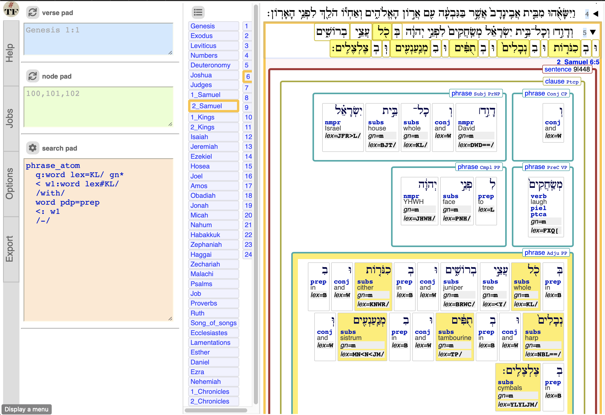

# Usage

**Pre version 7 users: also consult the [v7 guide](Use7.md).**

## Apps

Text-Fabric is a generic engine to process text corpora enriched with sets of annotations.

For a growing set of
[corpora](../About/Corpora.md)
additional functionality is available in the form of *apps*.

## Text-Fabric browser

App-supported corpora can be explored in a
[browser interface](Browser.md)
that is usable without programming.
Only familiarity with search templates is needed.



## Search templates

Text-Fabric has a powerful yet intuitive search engine that works with
[templates](Search.md),
which follow closely the features of the annotations to the corpus.

(Uruk corpus)

```
tablet catalogId=P448702
  line
    case terminal=1 number=2a
        sign type=ideograph
        :> sign type=numeral
```

(Bhsa corpus)

```
clause
/where/
  phrase function=Pred
/have/
  /without/
    word sp#verb
  /-/
/-/
  phrase function=Subj
```

(Bhsa corpus)

```
query = '''\n",
aya\n",
  word pos=verb
  <: word pos=noun posx=proper root=Alh
```

## Text-Fabric API

When mere search is not enough,
analysis by means of programming is the next step.
You can "talk" to your corpus through an
[API](../Api/App.md)
dedicated to your corpus which can download its data and display its material.

You can use it together with the generic [TF API](../Api/Fabric.md) to

* search your corpus programmatically by means of the same templates,
* prepare derived data for analysis in R, and
* create new data and distribute it to others.

Uruk programming example:


Bhsa programming example:


Quran programming example:


