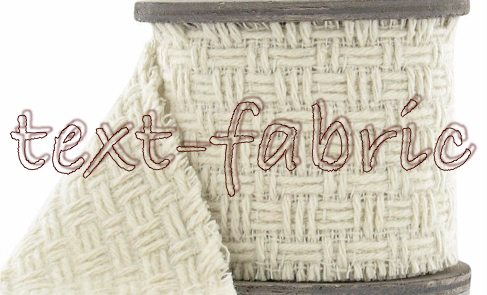

Text-Fabric is a Python3 package for Text plus Annotations.

It provides a data model, a text file format, and a binary format for (ancient) text plus
(linguistic) annotations.

The emphasis of this all is on:

* data processing
* sharing data
* contributing modules

A defining characteristic is that Text-Fabric does not make use of XML or JSON,
but stores text as a bunch of plain text files.
Each of these files contains the data of a single feature,
aligned with a *graph* of nodes and edges, which make up the
abstract fabric of the text.

## Install

Have [Python3](https://www.python.org/downloads/) on your system.

Optionally install [Jupyter](http://jupyter.org) as well:

```sh
pip3 install jupyter
```

Install Text-Fabric:

```sh
pip3 install text-fabric
```

Get the Hebrew Bible:

```sh
cd ~/github/etcbc
git clone https://github.com/etcbc/bhsa
```

or get example corpora (Greek, Sanskrit, Babylonian):

```sh
cd ~/github
git clone https://github.com/Dans-labs/text-fabric-data
```

Start programming: write a python script or code in the Jupyter notebook

```sh
cd somewhere-else
jupyter notebook
```

Enter the following text in a code cell

```python
from tf.fabric import Fabric
TF = Fabric(modules=['my/dataset'])
api = TF.load('sp lex')
api.makeAvailableIn(globals())
```

Maybe you have to tell Text-Fabric exactly where your data is.
If you have the data in a directory `text-fabric-data`
under your home directory  or under `~/github`, Text-Fabric can find it.
In your `modules` argument you then specify one or more subdirectories of
`text-fabric-data`.

Note to "Hebrew" users: the Hebrew dataset is no longer in the `text-fabric-data` repository.
That repository is meant for examples and tutorials for various corpora.
The Hebrew data is now in the [bhsa](https://github.com/ETCBC/bhsa) repository on GitHub
and here is how you can load it, assuming you have cloned it into `~/github/etcbc'.

```python
TF = Fabric(locations='~/github/etcbc', modules=['bhsa/tf/2017', 'parallels/tf/2017'])
```

You might want to consult the
[tutorial](/Dans-labs/text-fabric/blob/master/docs/tutorial.ipynb).
It contains a lot of test cases and elementary examples of what Text-Fabric can do.

## About

Most ideas derive from an earlier project, 
[LAF-Fabric](https://github.com/Dans-labs/laf-fabric).
We have taken out everything that makes LAF-Fabric complicated and is not essential for the
kind of data processing we have in mind.

[Motivation](http://www.slideshare.net/dirkroorda/text-fabric)

[Data](https://github.com/Dans-labs/text-fabric-data)

---
[Previous](Roadmap) -
[Next](News)

